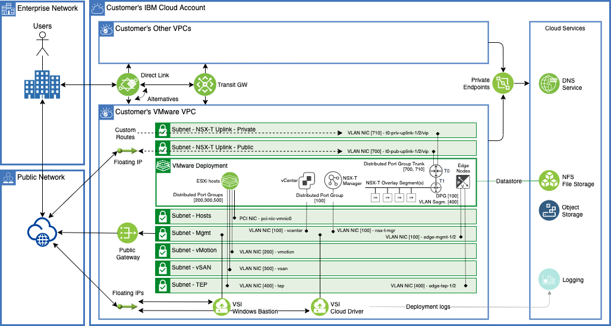

# VMware on VPC IaaS



The IBM Cloud bare metal server is integrated with the VPC network, and you can take advantage of the network, storage, and security capabilities provided by IBM Cloud VPC. Use VMware vSAN™ for storage and VMware NSX-T™ for network capabilities. You can easily and quickly add and remove ESXi hosts. Also, add, configure, and remove VMware vSphere® clusters as you like. If your storage needs grow, you can add and attach IBM Cloud VPC file shares.
After the bare metal server provisioning and initial VMware configurations, you can access and manage the IBM-hosted environment. To do this step, you can use VMware clients, command line interface (CLI), existing scripts, or other familiar vSphere API-compatible tools. These options can be combined with IBM Cloud automation solutions, such as using IBM Cloud Terraform provider with Schematics.
For the required common services, such as NTP and DNS, you can use IBM Cloud VPC basic services and solutions. For Active Directory™, you can use IBM Cloud VPC compute resources to build your Active Directory in IBM Cloud VPC, or interconnect with your existing Active Directory infrastructure.
For connectivity needs, you can use IBM Cloud VPC and IBM Cloud interconnectivity solutions. For public internet network access capabilities, the options include floating IP addresses and Public Gateway configurations within your VPC.
On-premises connectivity over public internet can be arranged by using IBM Cloud VPC VPN services (site-to-site and client-to-site), or alternatively NSX-T built-in capabilities. For private networking, you can use IBM Cloud interconnectivity services to connect your VMware workloads with IBM Cloud classic infrastructure, other VPCs, and on-premises networks.

## Key responsibilities

With the roll-your-own VMware Solutions in IBM Cloud VPC, you are responsible for ordering the VPC, prefixes, and subnets for it. Also, ordering the IBM Cloud bare metal server and setting up the vSphere clusters, including installing and configuring VMware vCenter Server®, vSAN, NSX-T, attaching file storage.
The IBM Cloud bare metal server for IBM Cloud VPC has the VMware ESXi™ 7.x hypervisor preinstalled. IBM can manage the licensing, or you can bring your own license to the solution.
For day two of operation, it is your responsibility to monitor and manage the vCenter and NSX-T, including backups, patching, configuration, and monitoring of the VMware software and the underlying vSphere hypervisor.

## Key benefits

The architecture provides fundamental building blocks, which include VMware vSphere, vCenter Server, VMware NSX-T, and shared storage options, such as VMware vSAN or IBM Cloud VPC file share. These building blocks are needed to flexibly design a VMware software-defined data center solution that best fits your workloads.

*VMware Solutions in IBM Cloud VPC have the following key benefits over IBM Cloud classic deployments:*

- IBM Cloud VPC gives you the ability to easily and rapidly define and control a virtual network, which is logically isolated from all other tenants. The logical isolation is implemented by using virtual network functions and security that is built into the platform.
- Provisioning the IBM Cloud bare metal server on IBM Cloud VPC takes minutes instead of hours when compared to the IBM Cloud classic IBM Cloud bare metal server.
- VMware workloads by running in IBM Cloud VPC can take advantage of all original functions for VPC networking capabilities and other IBM Cloud interconnectivity services.
With this single-tenant IBM Cloud bare metal server infrastructure that is provided in IBM Cloud VPC, you can quickly deploy network, compute, and storage capacity for your VMware environment to the IBM Cloud in minutes.
- Unlike the managed service offerings, this architecture gives you flexibility to design a solution for your needs, and provides you full and complete access to all components.

## Compatibility

- Terraform 0.14 and above.
- IBM Cloud Terraform provider 1.41.1 and above

## Running this template

### IBM Cloud API Key

The *ibmcloud_api_key* terraform variable must be generated prior to running this template. Please refer to [IBM Cloud API Key](https://www.ibm.com/docs/en/app-connect/containers_cd?topic=servers-creating-cloud-api-key)

### Deployment 

The following variables dictate the location of the deployent.

```hcl
variable "ibmcloud_vpc_region" {
  description = "Enter the target Region of IBM Cloud"
  default = "eu-de"
}

variable "vpc_zone" {
  description = "VPC Zone"
  default     = "eu-de-1"
}
```


