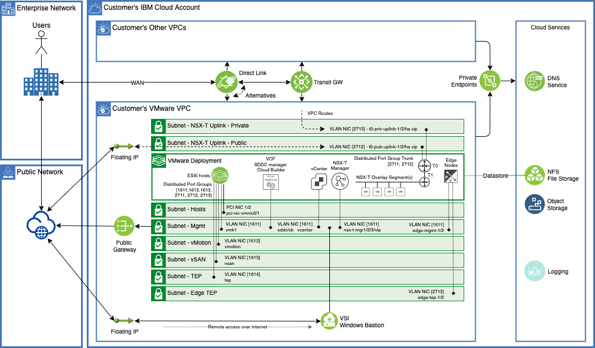

# VMware on VPC IaaS

The IBM Cloud bare metal server is integrated with the VPC network, and you can take advantage of the network, storage, and security capabilities provided by IBM Cloud VPC. Use VMware vSAN™ for storage and VMware NSX-T™ for network capabilities. You can easily and quickly add and remove ESXi hosts. Also, add, configure, and remove VMware vSphere® clusters as you like. If your storage needs grow, you can add and attach IBM Cloud VPC file shares. For more information on Bare Metal Servers on VPC and VMware solution on VPC architecture, see [About Bare Metal Servers for VPC](https://cloud.ibm.com/docs/vpc?topic=vpc-about-bare-metal-servers&interface=ui). 

After the bare metal server provisioning and initial VMware configurations, you can access and manage the IBM-hosted environment. To do this step, you can use VMware clients, command line interface (CLI), existing scripts, or other familiar vSphere API-compatible tools. These options can be combined with IBM Cloud automation solutions, such as using IBM Cloud Terraform provider with Schematics. 

This terraform provisions VPC assets with two architectures. The roll-your-own option provisions VPC, subnets and hosts based on [VMware roll-our-own architecture in VPC](https://cloud.ibm.com/docs/vmwaresolutions?topic=vmwaresolutions-vpc-ryo-overview). An overview of the solution is shown below.


Optionally, you can deploy VPC assets following VMware CLoud Foundation (VCF) architecture.  



For the required common services, such as NTP and DNS, you can use IBM Cloud VPC basic services and solutions. For Active Directory™, you can use IBM Cloud VPC compute resources to build your Active Directory in IBM Cloud VPC, or interconnect with your existing Active Directory infrastructure.

For connectivity needs, you can use IBM Cloud VPC and IBM Cloud interconnectivity solutions. For public internet network access capabilities, the options include floating IP addresses and Public Gateway configurations within your VPC. VPC routes are used to route traffic to NSX-T overlay through Tier 0 Gateway.

On-premises connectivity over public internet can be arranged by using IBM Cloud VPC VPN services (site-to-site and client-to-site), or alternatively NSX-T built-in capabilities. For private networking, you can use IBM Cloud interconnectivity services to connect your VMware workloads with IBM Cloud classic infrastructure, other VPCs, and on-premises networks.

## Key Responsibilities

With the roll-your-own VMware Solutions in IBM Cloud VPC, you are responsible for ordering the VPC, prefixes, and subnets for it. Also, ordering the IBM Cloud bare metal server and setting up the vSphere clusters, including installing and configuring VMware vCenter Server®, vSAN, NSX-T, attaching file storage.

The IBM Cloud bare metal server for IBM Cloud VPC has the VMware ESXi™ 7.x hypervisor preinstalled. IBM can manage the licensing, or you can bring your own license to the solution.

For day two of operation, it is your responsibility to monitor and manage the vCenter and NSX-T, including backups, patching, configuration, and monitoring of the VMware software and the underlying vSphere hypervisor.

## Key Benefits

The architecture provides fundamental building blocks, which include VMware vSphere, vCenter Server, VMware NSX-T, and shared storage options, such as VMware vSAN or IBM Cloud VPC file share. These building blocks are needed to flexibly design a VMware software-defined data center solution that best fits your workloads.

*VMware Solutions in IBM Cloud VPC have the following key benefits over IBM Cloud classic deployments:*

- IBM Cloud VPC gives you the ability to easily and rapidly define and control a virtual network, which is logically isolated from all other tenants. The logical isolation is implemented by using virtual network functions and security that is built into the platform.
- Provisioning the IBM Cloud bare metal server on IBM Cloud VPC takes minutes instead of hours when compared to the IBM Cloud classic IBM Cloud bare metal server.
- VMware workloads by running in IBM Cloud VPC can take advantage of all original functions for VPC networking capabilities and other IBM Cloud interconnectivity services.
With this single-tenant IBM Cloud bare metal server infrastructure that is provided in IBM Cloud VPC, you can quickly deploy network, compute, and storage capacity for your VMware environment to the IBM Cloud in minutes.
- Unlike the managed service offerings, this architecture gives you flexibility to design a solution for your needs, and provides you full and complete access to all components.

## Compatibility

- Terraform 0.14 and above.
- IBM Cloud Terraform provider 1.41.1 and above

## Install

### Terraform

Be sure you have the correct Terraform version, you can choose the binary here:
- https://releases.hashicorp.com/terraform/

### Terraform Plugins

Be sure you have access to the provider plugins through Internet or you have doanloaded and compiled the plugins for your operating syste on $HOME/.terraform.d/plugins/

- [terraform-provider-ibm](https://github.com/IBM-Cloud/terraform-provider-ibm)


## Running This Template

### IBM Cloud API Key

The *ibmcloud_api_key* terraform variable must be generated prior to running this template. Please refer to [IBM Cloud API Key](https://www.ibm.com/docs/en/app-connect/containers_cd?topic=servers-creating-cloud-api-key)

### Deployment Location

The following variables dictate the location of the deployent.

```hcl
variable "ibmcloud_vpc_region" {
  description = "Enter the target Region of IBM Cloud"
  default = "eu-de"
}

variable "vpc_zone" {
  description = "VPC Zone"
  default     = "eu-de-1"
}
```

Note. Currently Bare Metal for VPC is supported in Frankfurt (eu-de), Dallas (us-south) and Washington DC (us-east) only. 

### Resource Creation

Resources created by this template are based on the *resource_prefix* and a random number assigned at execution.

The *resource_prefix* should be changed for each new deployment:

```hcl
variable "resource_prefix" {
  description = "Resource Group Prefix to create in the IBM Cloud account"
  default = "vmw"
}
```

The calculated resource prefix that is actually used in resource created is defined as follows:

```hcl
resource "random_string" "resource_code" {
  length  = 3
  special = false
  upper   = false
#  number = false
}

locals {
  resources_prefix = "${var.resource_prefix}-${random_string.resource_code.result}"
}
```

### Deployment Customization

The following variables dictate the boolean inclusion of certain optional features.

```hcl
variable "deploy_iam" {
  description = "Boolean to enable IAM deployment."
  default = true
}

variable "deploy_fileshare" {
  description = "Boolean to enable fileshare deployment. Alternatively customize the cluster map."
  default = true
}

variable "deploy_dns" {
  description = "Boolean to enable DNS service deployment."
  default = true
}

variable "enable_vcf_mode" {
  description = "Boolean to enable VCF options for BMS deployment (dual PCI uplinks and vmk1 in instance management subnet)."
  default = false
}

variable "deploy_bastion" {
  description = "Boolean to enable Windows Bastion VSI to help VMware SDDC configuration and deployment."
  default = false
}
```

*Please Note:* The inclusion of file sharing is only available on a non-public version of the IBM Cloud VPC Terraform provider. Please set to false if this provider is not available.

*Please Note:* The inclusion of VCF mode is not publicly available in IBM Cloud VPC. Please set to false if this provider is not available.

### VPC Network Architecture

The terraform deploys the network infrastucture as described in the [reference architecture for VMware deployment in VPC](https://cloud.ibm.com/docs/vmwaresolutions?topic=vmwaresolutions-vpc-ryo-vpc-vmw). The `vpc_zone_prefix` and `vpc_zone_prefix_t0_uplinks` variables describe the prefixes used for *infrastucture and NSX-T T0 uplink subnets*.

```hcl
variable "vpc_zone_prefix" {
  description = "This is the address prefix for VMware components for each zone. /22 is recommended for appx. 120 hosts, /23 for appx. 60 hosts etc."
  default  = "10.100.0.0/22"
}

variable "vpc_zone_prefix_t0_uplinks" {
  description = "This is the NSX-T uplink address prefix for each zone."
  default  = "192.168.10.0/24"
}
```

`xyz_vlan_id` variables define the VLAN IDs used with BMS VLAN interfaces for `vmks`, SDDC appliances or NSX-T Tier 0 Gateway uplinks. Note that these VLAN IDs have only local significance to the BMS and ESXi host.

```hcl
variable "host_vlan_id" {
  description = "VLAN ID for host network"
  default     = 0 
}

variable "mgmt_vlan_id" {
  description = "VLAN ID for management network"
  # default     = 100 ## IBM Cloud ref arch
  default     = 1611 ## VCF default
}

variable "vmot_vlan_id" {
  description = "VLAN ID for vMotion network"
  # default     = 200 ## IBM Cloud ref arch
  default     = 1612 ## VCF default
}

variable "vsan_vlan_id" {
  description = "VLAN ID for vSAN network"
  # default     = 300 ## IBM Cloud ref arch
  default     = 1613 ## VCF default
}

variable "tep_vlan_id" {
  description = "VLAN ID for TEP network"
  # default     = 400 ## IBM Cloud ref arch
  default     = 1614 ## VCF default
}

variable "edge_uplink_public_vlan_id" {
  description = "VLAN ID for T0 public uplink network"
  # default     = 700 ## IBM Cloud ref arch
  default     = 2711 ## VCF default
}

variable "edge_uplink_private_vlan_id" {
  description = "VLAN ID for T0 private uplink network"
  # default     = 710 ## IBM Cloud ref arch
  default     = 2712 ## VCF default
}

variable "edge_tep_vlan_id" {
  description = "VLAN ID for TEP network" ## not used in IBM Cloud ref arch
  default     = 2713 ## VCF default
}
```

The variable `vpc` defines the *subnets* to be created using the created prefixes. The terraform creates the subnets with the subnet size as defined in the variable (e.g. `vpc_zone_subnet_size = 3` for a `/22` prefix means a subnet mask `/25` and likewise a `4` for a `/24` prefix means a subnet mask `/28`).

```hcl
variable "vpc" {
    description = "VPC Data Structure"
    type        = map
    default = {
      vpc = {
        zones = {
            vpc_zone = {
              infrastructure = {
                  vpc_zone_subnet_size = 3
                  public_gateways = ["subnet-public-gateway"]
                  subnets = {
                    host-mgmt = {
                        cidr_offset = 0
                        ip_version = "ipv4"
                    },
                    inst-mgmt = {
                        cidr_offset = 1
                        ip_version = "ipv4"
                        public_gateway = "subnet-public-gateway"
                    },
                    vmot = {
                        cidr_offset = 2
                        ip_version = "ipv4"
                    },
                    vsan = {
                        cidr_offset = 3
                        ip_version = "ipv4"
                    },
                    tep = {
                        cidr_offset = 4
                        ip_version = "ipv4"
                    }
                }
              },
              t0-uplink = {
                  vpc_zone_subnet_size = 4
                  subnets = {
                    t0-priv = {
                        cidr_offset = 0
                        ip_version = "ipv4"
                    },
                    t0-pub = {
                        cidr_offset = 1
                        ip_version = "ipv4"
                    }
                  }
              }
            }
        }
      }
    }
}
```

### Deployment Architecture

The `zone_clusters` variable describes the architecture of the deployment, including the *clusters*, *hosts* and *file shares*.

In this example we will deploy a single cluster with a single host of profile *bx2d-metal-96x384*. We can increase the number of hosts or clusters by manipulating this variable.

```hcl
variable "zone_clusters" {
  description = "Clusters in VPC"
  type        = map
  default     = {
    cluster_0 = {
      name = "mgmt"
      vmw_host_profile = "bx2d-metal-96x384"
      host_count = 1
      vpc_file_shares = [
        {
          name = "cluster0_share1" 
          size = 500 
          profile = "tier-3iops" 
          target = "cluster0_share1_target"
        }
      ]
    }
  }
}
```

The ESXI image type is the same across all Bare Metal servers and is described as follows:

```hcl
variable "esxi_image" {
  description = "Base ESXI image name, terraform will find the latest available image id"
  default = "esxi-7-byol"
}
```
Terraform will find the latest avialable version based on the above image type.

In order to determine the available image types, run the following IBM CLoud console command:

```bash
> ibmcloud is images | grep esx

r006-a40de20b-f936-454b-94de-395a2f4cf940   ibm-esxi-7-amd64-4                                 available    amd64   esxi-7                               7.x                                         1               public       provider     none         -   
r006-199c5cfc-a692-4682-a3c6-a81cfafd3755   ibm-esxi-7-byol-amd64-4                            available    amd64   esxi-7-byol                          7.x                                         1               public       provider     none         -   
r006-2d1f36b0-df65-4570-82eb-df7ae5f778b1   ibm-esxi-7-amd64-1                                 deprecated   amd64   esxi-7                               7.x                                         1               public       provider     none         -   
r006-95325076-0a3a-4e2e-8678-56908ddfcea0   ibm-esxi-7-byol-amd64-1                            deprecated   amd64   esxi-7-byol                          7.x                                         1               public       provider     none         -   

```

The key *vmw_host_profile* represents the host profile and may be customised for each cluster. Valid values may be determined fromt the IBM Cloud console:

```bash
>  ibmcloud is bm-prs 
Listing bare metal server profiles in region us-south under account IBM - IC4VS - Architecture as user ...
Name                 Architecture   Family     CPU socket count   CPU core count   Memory(GiB)   Network(Mbps)   Storage(GB)   
bx2-metal-96x384     amd64          balanced   2                  48               384           100000          1x960   
bx2d-metal-96x384    amd64          balanced   2                  48               384           100000          1x960, 8x3200   
bx2-metal-192x768    amd64          balanced   4                  96               768           100000          1x960   
bx2d-metal-192x768   amd64          balanced   4                  96               768           100000          1x960, 16x3200   
cx2-metal-96x192     amd64          compute    2                  48               192           100000          1x960   
cx2d-metal-96x192    amd64          compute    2                  48               192           100000          1x960, 8x3200   
mx2-metal-96x768     amd64          memory     2                  48               768           100000          1x960   
mx2d-metal-96x768    amd64          memory     2                  48               768           100000          1x960, 8x3200   
```

### Security Groups

The terraform template will create a variable number of security groups, the default set is provided below. These groups should not be removed, however, it is possible to add custom groups to for example open a port from a Bastion Server to the Bare Metal hosts.

```hcl
variable "security_group_rules" {

    description = "Security group Rules to create"
    #type        = map
    default = {
        "mgmt" = [
          {
            name      = "allow-icmp-mgmt"
            direction = "inbound"
            remote_id = "mgmt"
          },
          {
            name      = "allow-inbound-10-8"
            direction = "inbound"
            remote    = "10.0.0.0/8"
          },
          {
            name      = "allow-outbound-any"
            direction = "outbound"
            remote    = "0.0.0.0/0"
          }
        ]
        "vmot" = [
          {
            name      = "allow-icmp-mgmt"
            direction = "inbound"
            remote_id = "mgmt"
            icmp = {
              type = 8
            }
          },
          {
            name      = "allow-inbound-vmot"
            direction = "inbound"
            remote_id = "vmot"
          },
          {
            name      = "allow-outbound-vmot"
            direction = "outbound"
            remote_id = "vmot"
          }
        ]
        "vsan" = [
          {
            name      = "allow-icmp-mgmt"
            direction = "inbound"
            remote_id = "mgmt"
            icmp = {
              type = 8
            }
          },
          {
            name      = "allow-inbound-vsan"
            direction = "inbound"
            remote_id = "vsan"
          },
          {
            name      = "allow-outbound-vsan"
            direction = "outbound"
            remote_id = "vsan"
          }
        ]
        "tep" = [
          {
            name      = "allow-icmp-mgmt"
            direction = "inbound"
            remote_id = "mgmt"
            icmp = {
              type = 8
            }
          },
          {
            name      = "allow-inbound-tep"
            direction = "inbound"
            remote_id = "tep"
          },
          {
            name      = "allow-outbound-tep"
            direction = "outbound"
            remote_id = "tep"
          }
        ]
        "uplink" = [
          {
            name      = "allow-inbound-any"
            direction = "inbound"
            remote    = "0.0.0.0/0"
            icmp = {
              type = 8
            }
          },
          {
            name      = "allow-outbound-any"
            direction = "outbound"
            remote    = "0.0.0.0/0"
          }
        ]
    }
}
```


## Logical Template Flow

The terraform file names have been named to indicate the logical order of the resource creation and to group resource types into a single file, this has been done for convenience only.

```
00_vpc_vmware_esxi_random.tf
01_vpc_vmware_esxi_iam.tf
02_vpc_vmware_esxi_rg.tf
03_vpc_vmware_esxi_vpc.tf
04_vpc_vmware_esxi_dns_service.tf
05_vpc_vmware_esxi_ssh_key.tf
06_vpc_vmware_esxi_bare_metal.tf
07_vpc_vmware_esxi_vcenter.tf
08_vpc_vmware_esxi_nsxt.tf
10_vpc_vmware_esxi_dns_records.tf
11_vpc_vmware_esxi_vcf.tf
12_vpc_vmware_vsi_windows.tf
99_vpc_vmware_output.tf
```


## Example terraform.tfvars

The following provides an example `terraform.tfvars-example-for-ryo` for RYO deployments:

```hcl
# Services deployment options

deploy_dns = true
deploy_fileshare = false
deploy_iam = true
enable_vcf_mode = false
deploy_bastion = true


# Resource group name to use
# leave empty if you want to provision a new resource group

resource_group_name = ""


# Resource prefix for naming assets

resource_prefix = "vmw"


# DNS root domain

dns_root_domain = "vmw-test-1.ibmcloud.local"


# IBM CLoud Region and VPC Zone

ibmcloud_vpc_region = "us-south"
vpc_zone = "us-south-1"


# Hosts and clusters

# Use 'ibmcloud is bare-metal-server-profiles' to get the profiles.

zone_clusters = {
      cluster_0 = { 
         name = "converged"
         vmw_host_profile = "bx2d-metal-96x384"
         host_count = 4 
         vpc_file_shares = [ ] 
         },
   }


# Networking

vpc_zone_prefix = "10.100.0.0/22" # infrastucture subnets
vpc_zone_prefix_t0_uplinks = "192.168.10.0/24" # edge and tier 0 gateway subnets

mgmt_vlan_id = 100
vmot_vlan_id = 200
vsan_vlan_id = 300
tep_vlan_id	= 400

edge_uplink_public_vlan_id	= 700
edge_uplink_private_vlan_id = 710

vpc_t0_public_ips = 1


# Network security

security_group_rules = {
      "mgmt" = [
         {
            name      = "allow-all-mgmt"
            direction = "inbound"
            remote_id = "mgmt"
         },
         {
            name      = "allow-inbound-10-8"
            direction = "inbound"
            remote    = "10.0.0.0/8"
         },
         {
            name      = "allow-outbound-any"
            direction = "outbound"
            remote    = "0.0.0.0/0"
         }
      ]
      "vmot" = [
         {
            name      = "allow-icmp-mgmt"
            direction = "inbound"
            remote_id = "mgmt"
            icmp = {
            type = 8
            }
         },
         {
            name      = "allow-inbound-vmot"
            direction = "inbound"
            remote_id = "vmot"
         },
         {
            name      = "allow-outbound-vmot"
            direction = "outbound"
            remote_id = "vmot"
         }
      ]
      "vsan" = [
         {
            name      = "allow-icmp-mgmt"
            direction = "inbound"
            remote_id = "mgmt"
            icmp = {
            type = 8
            }
         },
         {
            name      = "allow-inbound-vsan"
            direction = "inbound"
            remote_id = "vsan"
         },
         {
            name      = "allow-outbound-vsan"
            direction = "outbound"
            remote_id = "vsan"
         }
      ]
      "tep" = [
         {
            name      = "allow-icmp-mgmt"
            direction = "inbound"
            remote_id = "mgmt"
            icmp = {
            type = 8
            }
         },
         {
            name      = "allow-inbound-tep"
            direction = "inbound"
            remote_id = "tep"
         },
         {
            name      = "allow-outbound-tep"
            direction = "outbound"
            remote_id = "tep"
         }
      ]
        "uplink-pub" = [
          {
            name      = "allow-inbound-any"
            direction = "inbound"
            remote    = "0.0.0.0/0"
            icmp = {
              type = 8
            }
          },
          {
            name      = "allow-outbound-any"
            direction = "outbound"
            remote    = "0.0.0.0/0"
          }
        ],
        "uplink-priv" = [
          {
            name      = "allow-inbound-any"
            direction = "inbound"
            remote    = "0.0.0.0/0"
          },
          {
            name      = "allow-outbound-any"
            direction = "outbound"
            remote    = "0.0.0.0/0"
          }
        ],
        "bastion" = [
          {
            name      = "allow-inbound-rdp"
            direction = "inbound"
            remote    = "0.0.0.0/0"
            tcp = {
              port_max = 3389
              port_min = 3389             
            }
          },
          {
            name      = "allow-outbound-any"
            direction = "outbound"
            remote    = "0.0.0.0/0"
          }
        ]
  }


```


The following provides an example `terraform.tfvars-example-for-vcf` for VCF deployments:

```hcl
# Services deployment options

deploy_dns = false
deploy_fileshare = false
deploy_iam = false
enable_vcf_mode = true
deploy_bastion = true


# Resource group name to use
# leave empty if you want to provision a new resource group

resource_group_name = "Default"


# Resource prefix for naming assets

resource_prefix = "vcf"


# DNS root domain

dns_root_domain = "vcf-test-1.ibmcloud.local"


# IBM CLoud Region and VPC Zone

ibmcloud_vpc_region = "us-south"
vpc_zone = "us-south-1"


# Hosts and clusters

# Use 'ibmcloud is bare-metal-server-profiles' to get the profiles.

zone_clusters = {
      cluster_0 = { 
         name = "converged"
         vmw_host_profile = "bx2d-metal-96x384"
         host_count = 4 
         vpc_file_shares = [ ] 
         },
   }


# Networking

vpc_zone_prefix = "10.100.0.0/22" # infrastucture subnets
vpc_zone_prefix_t0_uplinks = "192.168.10.0/24" # edge and tier 0 gateway subnets

vcf_avn_local_network_prefix = "172.27.16.0/24" # avn overlay local subnet
vcf_avn_x_region_network_prefix = "172.27.16.0/24" # avn overlay x-region subnet

vcf_avn_dns_records = {
     lcm = {
       name = "xint-vrslcm01"
       ip_address = "172.27.17.20"
     },
   }


mgmt_vlan_id = 1611
vmot_vlan_id = 1612
vsan_vlan_id = 1613
tep_vlan_id	= 1614

edge_uplink_public_vlan_id	= 2711
edge_uplink_private_vlan_id = 2712
edge_tep_vlan_id = 2713

vcf_host_pool_size = 10
vcf_edge_pool_size = 2   # Note two TEPs per edge nodes in VCF >> double reservation done in resource 

vpc_t0_public_ips = 1


# Network security

security_group_rules = {
      "mgmt" = [
         {
            name      = "allow-all-mgmt"
            direction = "inbound"
            remote_id = "mgmt"
         },
         {
            name      = "allow-inbound-10-8"
            direction = "inbound"
            remote    = "10.0.0.0/8"
         },
         {
            name      = "allow-outbound-any"
            direction = "outbound"
            remote    = "0.0.0.0/0"
         }
      ]
      "vmot" = [
         {
            name      = "allow-icmp-mgmt"
            direction = "inbound"
            remote_id = "mgmt"
            icmp = {
            type = 8
            }
         },
         {
            name      = "allow-inbound-vmot"
            direction = "inbound"
            remote_id = "vmot"
         },
         {
            name      = "allow-outbound-vmot"
            direction = "outbound"
            remote_id = "vmot"
         }
      ]
      "vsan" = [
         {
            name      = "allow-icmp-mgmt"
            direction = "inbound"
            remote_id = "mgmt"
            icmp = {
            type = 8
            }
         },
         {
            name      = "allow-inbound-vsan"
            direction = "inbound"
            remote_id = "vsan"
         },
         {
            name      = "allow-outbound-vsan"
            direction = "outbound"
            remote_id = "vsan"
         }
      ]
      "tep" = [
         {
            name      = "allow-icmp-mgmt"
            direction = "inbound"
            remote_id = "mgmt"
            icmp = {
            type = 8
            }
         },
         {
            name      = "allow-inbound-tep"
            direction = "inbound"
            remote_id = "tep"
         },
         {
            name      = "allow-outbound-tep"
            direction = "outbound"
            remote_id = "tep"
         }
      ]
        "uplink-pub" = [
          {
            name      = "allow-inbound-any"
            direction = "inbound"
            remote    = "0.0.0.0/0"
            icmp = {
              type = 8
            }
          },
          {
            name      = "allow-outbound-any"
            direction = "outbound"
            remote    = "0.0.0.0/0"
          }
        ],
        "uplink-priv" = [
          {
            name      = "allow-inbound-any"
            direction = "inbound"
            remote    = "0.0.0.0/0"
          },
          {
            name      = "allow-outbound-any"
            direction = "outbound"
            remote    = "0.0.0.0/0"
          }
        ],
        "bastion" = [
          {
            name      = "allow-inbound-rdp"
            direction = "inbound"
            remote    = "0.0.0.0/0"
            tcp = {
              port_max = 3389
              port_min = 3389             
            }
          },
          {
            name      = "allow-outbound-any"
            direction = "outbound"
            remote    = "0.0.0.0/0"
          }
        ]
  }


```
